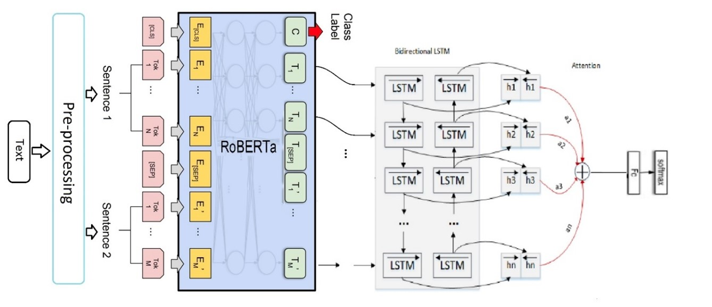

# EMOdel
# Emotion Analysis with RoBERTa + BiLSTM + Attention

This repository contains a complete implementation of a **multi-label fine-grained emotion classification** model designed for noisy, informal text such as tweets and Reddit comments. The system detects subtle and overlapping emotional signals using a hybrid architecture built on top of **RoBERTa**, **BiLSTM**, and a **custom attention mechanism**.

> **Note:**  
> This project was originally developed a few years ago. I recently found the code and decided to upload it.  
> Some parts may not reflect my current coding style or the final optimized version.  
> I may update it over time.

---

## ⭐ Project Overview

Emotion analysis aims to assign emotional states (anger, joy, admiration, confusion, etc.) to text.  
Unlike classic sentiment analysis (positive/negative), **a single sentence can express multiple overlapping emotions**.

Examples:
- “I loved him, but losing him broke me.” → *love + grief + sadness*  
- “Are you kidding me?!” → *annoyance + confusion + surprise*

This project focuses on **multi-label emotion classification** using deep learning and transformer-based models.

---

## 🧠 Model Architecture



The proposed model (“**EMOdel**”) includes:

### 1. RoBERTa
- Provides contextual embeddings trained on 160GB of text  
- More robust than BERT (dynamic masking, larger corpus)  
- Outputs token-level embeddings  

### 2. BiLSTM
- Reads sequences in both directions  
- Captures long-range dependencies in informal text  

### 3. Attention Layer
- Learns which words contribute most to the emotional meaning  
- Helps especially with long sequences  

### 4. Dense Layer + Softmax
- Outputs multi-label emotion probabilities  

### 5. Custom Weighted Loss Function
Designed to handle:
- Imbalanced classes  
- Multi-label structure  
- Rare emotion categories  

---

## 🧹 Preprocessing Pipeline

User-generated text contains slang, emojis, typos, repeated chars, and inconsistent casing.  
The preprocessing pipeline includes:

- Lowercasing  
- Removing noise and meaningless characters  
- Replacing URLs, mentions, hashtags with tokens  
- Converting emojis into descriptive words  
- Expanding contractions (`you're` → `you are`)  
- Normalizing slang (`idk`, `omg`, `cuz`)  
- Removing elongated characters (`yessss` → `yes`)  
- Dictionary-based correction for unusual tokens  

**Before preprocessing:** ~13,000 unique OOV tokens  
**After preprocessing:** ~5,000 meaningful tokens

---

## 📚 Datasets Used

### GoEmotions
- 27 emotions + neutral  
- ~58k Reddit comments  
- Multi-label  

### SemEval 2018
- ~7k tweets  
- 13 emotions  
- Multi-label  

Additional references: ISEAR, EmoBank, CrowdFlower.

---

## 📊 Exploratory Analysis Highlights

- Most samples contain 1–2 emotion labels  
- Some contain 3–5 overlapping emotions  
- Most common label: **neutral**  
- Rarest labels: **grief**, **remorse**  
- Average text length: 12–16 tokens  

---

## ⚙️ Training Details

- Transformer: RoBERTa-base  
- Encoder: BiLSTM  
- Mechanism: Attention  
- Loss: Custom weighted BCE  
- Optimizer: AdamW  
- Max sequence length: 128  

---

## 🧪 Evaluation Metrics

Used standard metrics for multi-label classification:

- **Accuracy**  
- **Precision**  
- **Recall**  
- **F1-score (macro + micro)**  

---

## 📈 Results

The model achieved **better performance than the GoEmotions baseline** in many emotion categories.

Improved groups include:
- admiration  
- anger  
- amusement  
- confusion  
- disapproval  
- love  
- surprise  

### Example Prediction

Input:

```
Unfortunately I lost my dad today. He was a hilarious man.
He used to tell jokes all the time. I loved him so much.
```

Model output:
- grief  
- sadness  
- love  
- remorse  

Even though the later sentences contain positive language, the model correctly captures the emotional meaning.

---

## 🚧 Limitations

- Rare classes have fewer examples  
- Reddit-style comments may not generalize to all domains  
- Preprocessing can be further improved  
- Limited multi-sentence context handling  

---

## 🔮 Future Work

- Upgrade to larger models (DeBERTa, RoBERTa-large)  
- Add custom transformer blocks  
- Improve domain generalization  
- Use contrastive learning  
- More advanced attention mechanisms  

---

## 📝 Final Note

This project was originally developed years ago and recently recovered.  
Some parts may not reflect my current best practices, and I may continue updating the repository over time.

---
